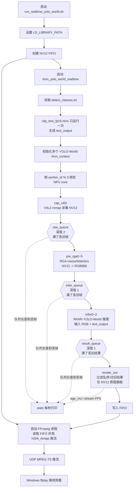

# RK3588 YOLO-World 实时检测 C++ Demo

[](https://www.bilibili.com/video/BV14pJP6kEbC/)

[点击观看视频教程：基于RK3588的实时摄像头视频流 yolo-world 检测](https://www.bilibili.com/video/BV14pJP6kEbC/)

这是面向鲁班猫 5 / RK3588 的 YOLO-World 实时摄像头目标检测 C++ 代码和启动脚本。

本仓库只保存源码和脚本，不保存模型、ONNX、runtime 动态库、编译产物和本地部署包。

## 仓库内容

```text
cpp/                         C++ 图片 demo 和实时摄像头 demo 源码
run_realtime_yolo_world.sh   鲁班猫 5 实时检测推流启动脚本
README.md                    当前说明文档
LICENSE                      MIT 许可文件
```

GitHub 端只保留上述源码、脚本和说明文件。本地同步仓库与 GitHub 保持一致。

## cpp 目录文件说明

`cpp/` 目录是 RKNN Model Zoo 原 YOLO-World C++ demo 的基础上新增实时摄像头检测逻辑后的源码目录。各文件作用如下：

```text
cpp/
├── CMakeLists.txt
│   └── 定义 C++ demo 的编译规则；会编译图片检测 demo `rknn_yolo_world_demo`
│       和实时摄像头 demo `rknn_yolo_world_realtime`。
├── main.cc
│   └── 原始图片检测入口；读取图片文件，执行 YOLO-World 推理并输出检测结果。
├── realtime_main.cc
│   └── 实时摄像头检测入口；负责 V4L2 采集、RGA 预处理、多线程 RKNN 推理、
│       NV12 画框、写 FIFO 给 FFmpeg 推流以及运行状态统计。
├── postprocess.cc
│   └── YOLO-World 输出后处理；完成置信度过滤、NMS、框坐标还原、类别名映射。
├── postprocess.h
│   └── 后处理数据结构和接口声明，例如检测框、置信度、类别 id、阈值等。
├── rknpu2/
│   ├── clip_text/
│   │   ├── clip_text.cc
│   │   │   └── `clip_text_fp16.rknn` 的初始化、输入设置、推理和输出读取。
│   │   │       启动时读取 `detect_classes.txt`，调用 tokenizer 得到 token id，
│   │   │       再生成后续 YOLO-World 每帧复用的 `text_output`。
│   │   └── clip_text.h
│   │       └── clip text RKNN 上下文和接口声明。
│   └── yolo_world/
│       ├── yolo_world.cc
│       │   └── `yolo_world_v2s_i8.rknn` 的初始化、输入设置、推理和释放。
│       └── yolo_world.h
│           └── YOLO-World RKNN 上下文和接口声明。
└── tokenizer/
    ├── clip_tokenizer.cpp
    │   └── CLIP tokenizer 实现；把类别文本切分并编码成 `clip_text.rknn`
    │       需要的 token id 序列。
    ├── clip_tokenizer.h
    │   └── tokenizer 接口声明，包含 BOS/EOS/PAD token id 和 BPE 编码接口。
    └── clip_vocab.h
        └── 内置 CLIP tokenizer 词表/BPE 数据，供 `clip_tokenizer.cpp` 使用。
```

`tokenizer/` 的作用只发生在启动阶段：它把 `detect_classes.txt` 里的文本类别转换成 `clip_text_fp16.rknn` 能接收的 token id。`clip_text_fp16.rknn` 再把这些 token id 转成文本特征 `text_output`。实时检测过程中，每一帧只复用这份 `text_output` 跑 `yolo_world_v2s_i8.rknn`，不会每帧重复执行 tokenizer 或 `clip_text_fp16.rknn`。

## 部署包下载

已经打包好的板端部署包可通过百度网盘下载：

- 文件：`deploy.zip`
- 下载链接：[百度网盘 deploy.zip](https://pan.baidu.com/s/1fRD_RSMoV3zHEleIkxwFUA?pwd=Gxbm)
- 提取码：`Gxbm`

`deploy.zip` 内包含本项目运行所需的 RKNN 模型、RKNN runtime/RGA 动态库、已编译好的 C++ demo 和运行脚本。下载后解压到鲁班猫 5 / RK3588 板端即可直接使用，不需要在板端重新编译。

板端运行目录仍然需要保持类似结构：

```text
rknn_yolo_world_demo/
├── lib/
│   ├── librga.so
│   └── librknnrt.so
├── model/
│   ├── clip_text_fp16.rknn
│   ├── detect_classes.txt
│   └── yolo_world_v2s_i8.rknn
├── rknn_yolo_world_realtime
└── run_realtime_yolo_world.sh
```

## 自己转换模型或二次开发

如果只是想直接跑通我这个实时检测流程，优先使用上面的 `deploy.zip`。它已经包含 RKNN 模型、runtime 动态库、编译好的 C++ demo 和启动脚本，解压到鲁班猫 5 / RK3588 后按本文的启动方式运行即可。

如果想自己体验 ONNX 到 RKNN 的转换流程，或者基于这个项目实现自己的独特 demo 流程，需要另外准备 Rockchip 官方工具链和完整工程。常见本地目录大致会类似：

```text
.venv-rknn/        Python 虚拟环境，用于安装和运行 RKNN-Toolkit2
rknn-toolkit2/     RKNN 模型转换、量化、导出工具
rknn_model_zoo/    官方 demo、C++ 编译脚本、runtime、RGA、utils 等工程依赖
```

官方入口：

- [RKNN-Toolkit2 官方仓库](https://github.com/airockchip/rknn-toolkit2)：用于在 PC 端将 ONNX 等模型转换为 RKNN，也负责量化、混合量化、模型导出等流程。
- [RKNN Model Zoo 官方仓库](https://github.com/airockchip/rknn_model_zoo)：包含各类 RKNN demo、C++ 示例、交叉编译脚本和示例工程结构。
- [rknpu2 runtime / driver 相关目录](https://github.com/airockchip/rknn-toolkit2/tree/master/rknpu2)：包含 RKNN runtime、include、板端库等相关内容。

具体模型转换命令、量化配置、环境安装方式和不同模型的适配细节，建议以官方仓库 README 和文档为准。这个仓库只保留 YOLO-World 实时摄像头 demo 的 C++ 源码和启动脚本，不包含完整的模型转换环境。

如果使用我网盘里的部署包，但想适配自己的摄像头或网络环境，建议优先修改 C++ 实时 demo 和启动脚本里的这些参数：

- 摄像头接口：例如 `/dev/video11` 是否需要改成自己的设备节点。
- 采集参数：例如 V4L2 输入分辨率、帧率、mmap buffer 数量、是否需要打开或关闭摄像头时域降噪。
- RGA 预处理参数：例如输入尺寸变化后是否仍能稳定转换到模型输入尺寸。
- 推流参数：例如推流分辨率、推流 FPS、码率、GOP、UDP 目标地址和端口。
- 推理线程数：根据实际延迟、NPU 占用率和输出 FPS 调整 `WORKERS`。

修改源码后仍然需要在完整 `rknn_model_zoo` 工程下重新编译，并保证环境里能找到：

```sh
aarch64-linux-gnu-gcc
aarch64-linux-gnu-g++
```

编译命令仍然是：

```sh
./build-linux.sh -t rk3588 -a aarch64 -d yolo_world
```

## 编译 C++ Demo

本仓库只保存 `examples/yolo_world` 这一部分源码，编译时依赖完整的 RKNN Model Zoo 工程。需要先准备：

- RKNN Model Zoo 源码目录，目录下应有 `build-linux.sh`。
- Linux 交叉编译工具链，并且环境里能直接找到 `aarch64-linux-gnu-gcc` 和 `aarch64-linux-gnu-g++`。
- RKNN Model Zoo 自带的 RKNN runtime、RGA、include、utils、3rdparty 等依赖目录。

可以先检查交叉编译器：

```sh
which aarch64-linux-gnu-gcc
which aarch64-linux-gnu-g++
```

将本仓库内容放到 RKNN Model Zoo 的 `examples/yolo_world/` 目录，例如：

```text
rknn_model_zoo/
├── build-linux.sh
├── 3rdparty/
├── examples/
│   └── yolo_world/
│       ├── cpp/
│       ├── run_realtime_yolo_world.sh
│       ├── README.md
│       └── LICENSE
└── ...
```

然后在 `rknn_model_zoo` 根目录编译 RK3588 aarch64 版本：

```sh
./build-linux.sh -t rk3588 -a aarch64 -d yolo_world
```

编译完成后，C++ demo 和实时 demo 产物会生成到：

```text
install/rk3588_linux_aarch64/rknn_yolo_world_demo/
```

其中实时检测程序是：

```text
install/rk3588_linux_aarch64/rknn_yolo_world_demo/rknn_yolo_world_realtime
```

## 板端启动

将编译好的 `rknn_yolo_world_realtime`、`run_realtime_yolo_world.sh`、`lib/` 和 `model/` 放到鲁班猫目录后执行：

```sh
cd ~/rknn_yolo_world_demo
chmod +x rknn_yolo_world_realtime run_realtime_yolo_world.sh
./run_realtime_yolo_world.sh
```

脚本会设置：

```sh
export LD_LIBRARY_PATH=./lib:${LD_LIBRARY_PATH:-}
```

## 默认实时参数

当前脚本默认参数：

```text
摄像头设备：/dev/video11
采集格式：NV12
采集分辨率：1920x1080
采集 FPS：60
V4L2 mmap buffer：8
推流 FPS：60
推流码率：10M
UDP 地址：udp://192.168.1.141:1235?pkt_size=1316
RGA 预处理线程：6
RKNN 推理线程：3
raw 队列：2
infer 队列：1
result 队列：1
```

3 个 RKNN 推理线程按 RK3588 的三个 NPU core 绑定：

```text
infer0 -> RKNN_NPU_CORE_0
infer1 -> RKNN_NPU_CORE_1
infer2 -> RKNN_NPU_CORE_2
```

## C++ 实时检测逻辑

实时检测入口是 `cpp/realtime_main.cc`，整体目标是绕开“摄像头保存 JPG、demo 再读取 JPG”的慢路径，直接走内存帧：

```text
V4L2 摄像头采集 -> NV12 内存帧 -> RGA 预处理 -> RKNN 推理 -> NV12 画框 -> FFmpeg/RKMPP 推流
```

程序启动后会先读取 `detect_classes.txt`，并用 `clip_text_fp16.rknn` 生成一次文本特征 `text_output`。这个步骤只在启动时执行一次，后续每一帧只运行 `yolo_world_v2s_i8.rknn`，不会每帧重复跑 `clip_text.rknn`。如果修改了 `detect_classes.txt` 里的检测类别，需要重启程序，让文本特征重新生成。

随后程序会为每个 RKNN 推理线程初始化一个独立的 `rknn_context`。默认 3 个推理线程分别绑定 RK3588 的三个 NPU core；如果通过环境变量增加 `WORKERS`，core mask 会按 `0 -> 1 -> 2 -> 0 -> ...` 轮询分配。

## 线程分工

默认脚本启动后，C++ 进程内部线程如下：

| 线程名 | 默认数量 | 作用 |
| --- | ---: | --- |
| `rknn_yolo_world` | 1 | 主线程，负责初始化、创建工作线程、等待退出信号 |
| `cap_v4l2` | 1 | 打开 `/dev/video11`，设置 NV12、1920x1080、60 FPS、8 个 mmap buffer，并持续采集帧 |
| `pre_rga0~5` | 6 | 使用 RGA 将原始 NV12 帧 resize/letterbox 到 YOLO 输入尺寸，并转成 RGB888 |
| `infer0~2` | 3 | 每个线程持有独立 `rknn_context`，调用 `rknn_run()` 进行 YOLO-World 推理 |
| `render_out` | 1 | 丢弃过旧结果，在原始 NV12 帧上画检测框和类别文字，然后写入 FIFO |
| `stats` | 1 | 每秒打印采集、预处理、推理、推流 FPS、队列占用、丢帧数和延迟 |

脚本还会额外启动一个 FFmpeg 进程，从 FIFO 读取 NV12 原始帧，用 `h264_rkmpp` 编码成 H.264，再通过 UDP 推给 Windows 上位机。

## 队列与低延迟策略

三个线程阶段之间用有界队列连接：

| 队列 | 默认深度 | 连接阶段 | 满队列策略 |
| --- | ---: | --- | --- |
| `raw_queue` | 2 | `cap_v4l2 -> pre_rga*` | 满了丢最旧的原始帧 |
| `infer_queue` | 1 | `pre_rga* -> infer*` | 满了丢最旧的预处理帧 |
| `result_queue` | 1 | `infer* -> render_out` | 满了丢最旧的推理结果 |

这里选择的是实时优先策略：宁可丢旧帧，也不让旧帧在队列里越排越久。NPU 忙时，`rknn_run()` 会在对应的 `infer*` 线程中等待 NPU 驱动返回，上游采集和 RGA 预处理仍然继续跑；如果推理跟不上采集速度，`infer_queue` 会持续保留较新的帧并丢弃旧帧。

推理线程并行返回时，结果可能乱序。`render_out` 会按帧序号过滤掉比已输出帧更旧的结果，同时按 `STREAM_FPS` 控制写给 FFmpeg 的输出节奏。这样最终看到的是尽量新的检测画面，而不是每一帧都排队检测。

## 流程图



## 性能观察方法

程序运行时会每秒输出类似：

```text
[stats] fps cap=60 pre=60 infer=38 stream=28 | age_ms=98 | queue raw=0/2 infer=1/1 result=0/1 | drops raw=0(+0) infer=1450(+23) result=11(+0) stale=818(+9) | errors cap=0 pre=0 infer=0 out=0
```

其中 `cap/pre/infer/stream` 分别表示采集、预处理、推理、写入 FFmpeg 的实时 FPS；`age_ms` 表示当前输出检测画面距离摄像头采集时间的板端延迟；`drops` 和 `stale` 越高，说明系统正在主动丢弃旧帧或旧结果以保持低延迟。

默认 3 推理线程在前面测试中的典型现象：

```text
采集：约 60 FPS
预处理：约 60 FPS
RKNN 推理：约 37~39 FPS
实际检测画面输出：约 25~28 FPS
板端检测延迟 age_ms：约 80~108 ms
```

## 推理线程数对性能的影响

RK3588 有 3 个 NPU core，但“推理线程越多”不等于“端到端越快”。每个推理线程都会持有一个独立的 `rknn_context` 并提交 `rknn_run()`，线程数过多时会让 NPU 队列更拥挤，结果返回更容易乱序，渲染线程也会丢弃更多旧结果。最终表现是 NPU 占用率上去了，但画面延迟也上去了。

前面在鲁班猫 5 / RK3588 上观察到的典型结果如下：

| RKNN 推理线程数 | RKNN 推理 FPS | 最终检测画面输出 FPS | `age_ms` 板端延迟 | NPU 占用现象 | 现象说明 |
| ---: | ---: | ---: | ---: | --- | --- |
| 12 | 约 48 FPS | 约 24~31 FPS | 约 222~281 ms | 三个 NPU core 约 98% | NPU 基本满载，但队列拥挤，旧结果明显增多 |
| 9 | 约 47~49 FPS | 约 25~33 FPS | 约 177~233 ms | 接近满载，常见约 98% | 推理 FPS 接近 12 线程，但延迟仍偏高 |
| 6 | 约 46~47 FPS | 约 25~33 FPS | 约 127~158 ms | 高占用，明显高于 3 线程 | 推理 FPS 没明显下降，延迟比 9/12 线程低 |
| 3 | 约 37~39 FPS | 约 25~28 FPS | 约 80~108 ms | 三个 NPU core 约 70% 左右 | 推理 FPS 下降，但端到端延迟最低，实时观感更好 |

这里的关键取舍是：如果目标是压榨 NPU 占用率，可以增加推理线程，让三个 NPU core 接近 98% 占用；如果目标是实时视频低延迟，过多推理线程反而会造成 `infer_queue`、NPU 内部任务和 `result_queue` 的拥挤，最后渲染线程会过滤掉大量旧结果。

`render_out` 线程的逻辑是只输出“更新、更合适的检测结果”：如果某个推理结果的帧序号比已经输出过的帧更旧，它会被当作 stale result 丢弃；如果输出间隔小于 `STREAM_FPS` 对应的时间间隔，也会跳过该结果。因此，最终推给 FFmpeg 的检测画面 FPS 不一定等于 RKNN 推理 FPS，而是由以下因素共同决定：

- RKNN 推理结果返回速度。
- 结果是否乱序或过旧。
- `STREAM_FPS` 的限速。
- `render_out` 画框和写 FIFO 的速度。
- FFmpeg/RKMPP 编码和 UDP 推流是否跟得上。

因此本项目默认保留 `WORKERS=3`，优先保证低延迟；如果你更重视检测结果密度，可以自行把 `WORKERS` 调到 6、9 或 12，再结合 `age_ms`、`stream` FPS、`stale` 数量和 NPU 占用率决定最终配置。

## Windows 接收端

上位机 Windows 可使用：

```powershell
ffplay -hide_banner -loglevel info `
  -fflags nobuffer `
  -flags low_delay `
  -framedrop `
  -sync video `
  -max_delay 0 `
  -probesize 32768 `
  -analyzeduration 0 `
  -f mpegts `
  -i "udp://0.0.0.0:1235?overrun_nonfatal=1&fifo_size=32768"
```

## 许可

本仓库源码和脚本使用 MIT License，详见 `LICENSE`。
