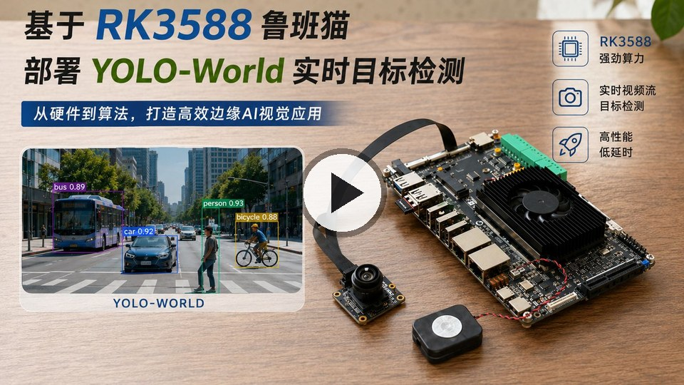

# RK3588 YOLO-World 实时检测 C++ Demo

[](https://www.bilibili.com/video/BV14pJP6kEbC/)

[点击观看视频教程：基于RK3588的实时摄像头视频流 yolo-world 检测](https://www.bilibili.com/video/BV14pJP6kEbC/)

这是面向鲁班猫 5 / RK3588 的 YOLO-World 实时摄像头目标检测 C++ 代码和启动脚本。

本仓库只保存源码和脚本，不保存模型、ONNX、runtime 动态库、编译产物和本地部署包。

## 仓库内容

```text
cpp/                         C++ 图片 demo 和实时摄像头 demo 源码
run_realtime_yolo_world.sh   鲁班猫 5 实时检测推流启动脚本
README.md                    当前说明文档
LICENSE                      MIT 许可文件
```

GitHub 端只保留上述源码、脚本和说明文件。本地同步仓库与 GitHub 保持一致。

## 部署包下载

已经打包好的板端部署包可通过百度网盘下载：

- 文件：`deploy.zip`
- 下载链接：[百度网盘 deploy.zip](https://pan.baidu.com/s/1fRD_RSMoV3zHEleIkxwFUA?pwd=Gxbm)
- 提取码：`Gxbm`

`deploy.zip` 内包含本项目运行所需的 RKNN 模型、RKNN runtime/RGA 动态库、已编译好的 C++ demo 和运行脚本。下载后解压到鲁班猫 5 / RK3588 板端即可直接使用，不需要在板端重新编译。

板端运行目录仍然需要保持类似结构：

```text
rknn_yolo_world_demo/
├── lib/
│   ├── librga.so
│   └── librknnrt.so
├── model/
│   ├── clip_text_fp16.rknn
│   ├── detect_classes.txt
│   └── yolo_world_v2s_i8.rknn
├── rknn_yolo_world_realtime
└── run_realtime_yolo_world.sh
```

## 编译 C++ Demo

本仓库只保存 `examples/yolo_world` 这一部分源码，编译时依赖完整的 RKNN Model Zoo 工程。需要先准备：

- RKNN Model Zoo 源码目录，目录下应有 `build-linux.sh`。
- Linux 交叉编译工具链，并且环境里能直接找到 `aarch64-linux-gnu-gcc` 和 `aarch64-linux-gnu-g++`。
- RKNN Model Zoo 自带的 RKNN runtime、RGA、include、utils、3rdparty 等依赖目录。

可以先检查交叉编译器：

```sh
which aarch64-linux-gnu-gcc
which aarch64-linux-gnu-g++
```

将本仓库内容放到 RKNN Model Zoo 的 `examples/yolo_world/` 目录，例如：

```text
rknn_model_zoo/
├── build-linux.sh
├── 3rdparty/
├── examples/
│   └── yolo_world/
│       ├── cpp/
│       ├── run_realtime_yolo_world.sh
│       ├── README.md
│       └── LICENSE
└── ...
```

然后在 `rknn_model_zoo` 根目录编译 RK3588 aarch64 版本：

```sh
./build-linux.sh -t rk3588 -a aarch64 -d yolo_world
```

编译完成后，C++ demo 和实时 demo 产物会生成到：

```text
install/rk3588_linux_aarch64/rknn_yolo_world_demo/
```

其中实时检测程序是：

```text
install/rk3588_linux_aarch64/rknn_yolo_world_demo/rknn_yolo_world_realtime
```

## 板端启动

将编译好的 `rknn_yolo_world_realtime`、`run_realtime_yolo_world.sh`、`lib/` 和 `model/` 放到鲁班猫目录后执行：

```sh
cd ~/rknn_yolo_world_demo
chmod +x rknn_yolo_world_realtime run_realtime_yolo_world.sh
./run_realtime_yolo_world.sh
```

脚本会设置：

```sh
export LD_LIBRARY_PATH=./lib:${LD_LIBRARY_PATH:-}
```

## 默认实时参数

当前脚本默认参数：

```text
摄像头设备：/dev/video11
采集格式：NV12
采集分辨率：1920x1080
采集 FPS：60
V4L2 mmap buffer：8
推流 FPS：60
推流码率：10M
UDP 地址：udp://192.168.1.141:1235?pkt_size=1316
RGA 预处理线程：6
RKNN 推理线程：3
raw 队列：2
infer 队列：1
result 队列：1
```

3 个 RKNN 推理线程按 RK3588 的三个 NPU core 绑定：

```text
infer0 -> RKNN_NPU_CORE_0
infer1 -> RKNN_NPU_CORE_1
infer2 -> RKNN_NPU_CORE_2
```

## Windows 接收端

上位机 Windows 可使用：

```powershell
ffplay -hide_banner -loglevel info `
  -fflags nobuffer `
  -flags low_delay `
  -framedrop `
  -sync video `
  -max_delay 0 `
  -probesize 32768 `
  -analyzeduration 0 `
  -f mpegts `
  -i "udp://0.0.0.0:1235?overrun_nonfatal=1&fifo_size=32768"
```

## 实时策略

- `clip_text.rknn` 只在程序启动时运行一次，生成文本特征后复用。
- 视频帧流程是 `V4L2 -> NV12 内存帧 -> RGA resize/letterbox -> RKNN -> NV12 画框 -> FFmpeg/RKMPP 推流`。
- 队列是低延迟优先，满了丢旧帧，不保证每一帧都检测。
- 统计日志每秒输出 `cap/pre/infer/stream` FPS、`age_ms`、队列占用、丢帧数和错误数。

3 推理线程实测现象：

```text
采集：约 60 FPS
预处理：约 60 FPS
RKNN 推理：约 37~39 FPS
实际检测画面输出：约 25~28 FPS
板端检测延迟 age_ms：约 80~108 ms
```

## 许可

本仓库源码和脚本使用 MIT License，详见 `LICENSE`。
